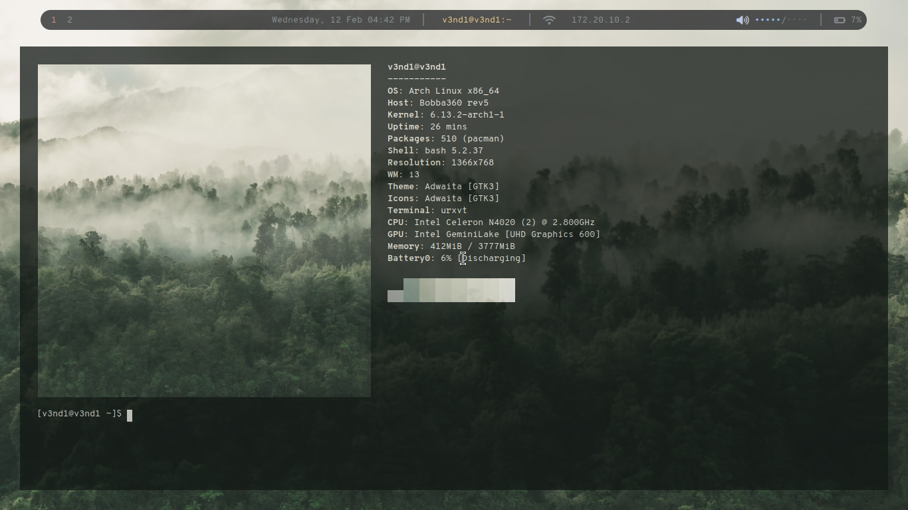
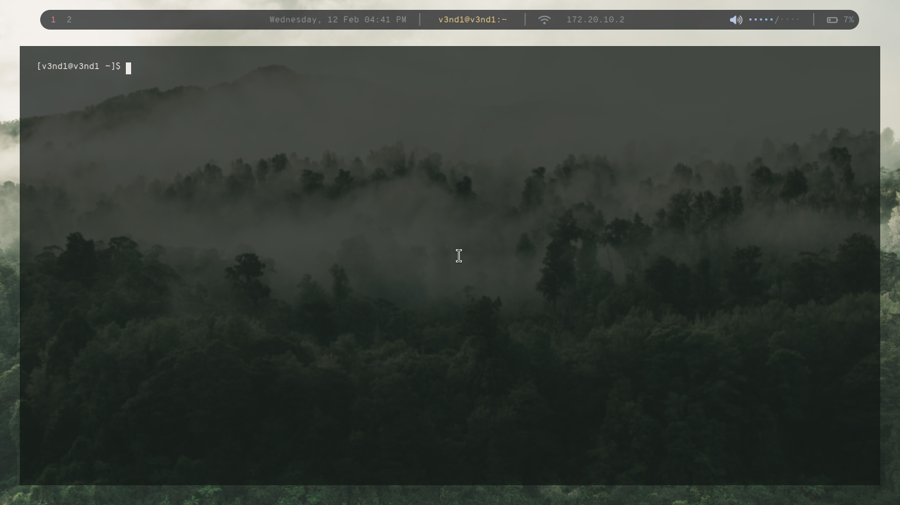
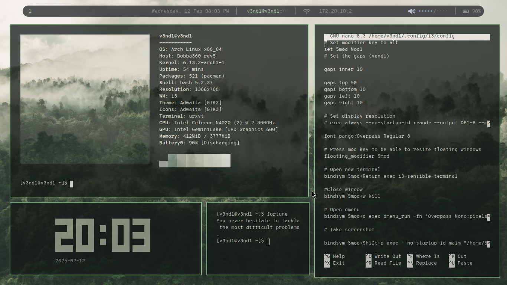

# Archbook
A complete guide on how to make your chromebook into a lightweight Arch machine with the i3 window manager.
Thanks to mrchromebox.tech for the custom UEFI and script.

## Screenshots





## Requirements
- A chromebook
- A screwdriver
- An USB with the latest ISO of archlinux (other distros can also be installed, but we will use arch for this build)

## Let's get started

First, check your chromebook model and your motherboard model, you can check your model at the bottom stickers.
I had the Acer R752T, so it had the Bobba360 motherboard, you can check your motherboard on > https://docs.mrchromebox.tech/docs/supported-devices.html#device-listing

### Developer mode
When you have your chromebook model, you have to turn on the Developer Mode. This might be different for other chromebooks model, search your developer mode keys. 
Careful, as this will delete all your local data. Turn on developer mode by:
- Power off
- Esc + Refresh + Power
- When you see a recuperation panel, press Ctrl + D
- Then set the OS verification off
- When the OS verification is off press Ctrl + D again
- Now, everytime you power on the chromebook, you will find the OS verification is OFF window, press Ctrl + D to boot normally into the dev mode.

Great, now setup your account again and DO NOT put a password to the developer, as it might bug and you wont be able to use sudo commands.
Once you boot in, you have to run the Firmware Utility Script, to see if you have fw write protection.

## Firmware Utility Script

Run it by using the vt2 terminal, while in desktop press Ctrl + Alt + F2 (or forward arrow).
Then, login with the user chronos, you should be able to boot in without a password.
Paste the following command in the terminal 
```bash
cd; curl -LO mrchromebox.tech/firmware-util.sh && sudo bash firmware-util.sh
```

You should see your chromebook info and your Firmware Protection status, if it's not enabled, skip the next step.
## Disabling Firmware Protection

This depends on the model you have, I had a Bobba360, so I did the battery method. Check out the motherboard page to see what method you should use > https://docs.mrchromebox.tech/docs/supported-devices.html#device-listing

### Method 1 : Removing the Write protection screw
- Power off the device
- Unscrew the back and open it
- Remove the WP screw, you can see it at > https://docs.mrchromebox.tech/docs/supported-devices.html#device-listing
- Reassemble the device
- Skip to the next step

### Method 2 : Disconnecting the battery
- Power off the device
- Unscrew the back and open it
- Remove the battery
- Plug in the charger to your usb-c port
- Reassemble the device
- Skip to the next step
- Once you finished the tutorial, you can put back in the battery

### Method 3 : Bridging a jumper
- Power off the device and unplug the charger
- Unscrew the back and open it
- Disconnect the battery
- Locate the WP jumper, you can see it at > https://docs.mrchromebox.tech/docs/supported-devices.html#device-listing
- If the jumper holes are opened, you can make a bridge with a paperclip, else, you might have to make a solder bridge
- Reconnect the battery
- Reassemble the device
- Skip to the next step

If in the list mentions you need a suzyq you can check how to do it at >https://docs.mrchromebox.tech/docs/firmware/wp/disabling.html#using-closed-case-debugging-ccd-using-a-suzyqable

## Installing the custom UEFI
Run the Firmware Utility Script at the vt2 terminal with
```bash
cd; curl -LO mrchromebox.tech/firmware-util.sh && sudo bash firmware-util.sh
```
Choose the second option (CAUTION: THIS MIGHT BRICK YOUR DEVICE, DO AT YOUR OWN RISK)
If its not available, sorry, you cannot install Arch Linux as your chromebook isnt compatible with custom UEFI.
Follow the instructions of the script.

## Booting into the custom UEFI
Once it's done, reboot your device yo boot into the custom uefi. When you see the UEFI logo, press esc, and plug in your installation USB. Go to boot options and boot with your USB, this should boot into your arch instalation.

## Installing arch
In this step we'll install arch linux.

Connect to wifi using iwctl utility : 

```bash
iwctl
device list
station name scan #replace name with your device name ex: wlan0
station name get-networks
station name connect SSID
```
Ethernet should just work right away.
Then write archinstall command, and choose your hour, partitions, hostname, username, password etc.
Its important for you to choose desktop profile and i3wm and pipewire audio. I recommend using networkmanager as a manager for wifi.

Press done and reboot your computer (IMPORTANT : Remove the instalation media.

## Ricing and configuring arch
Ricing is a term that means to make your OS look good, we'll do it with my dotfiles for i3wm.
Install the following packages with:

```bash
pacman -S cairo libxcb python2 neofetch nerd-fonts font-awesome xcb-proto xcb-util-image xcb-util-wm xcb-util-xrm jsoncpp i3-gaps dmenu ranger vim rxvt-unicode feh imagemagick python-pip python-pywal w3m git
```
Then, we should install yay to add some more packages.
```bash
cd ~
mkdir -p /tmp/yay_install
cd /tmp/yay_install

sudo pacman -S base-devel

sudo pacman -S expac yajl git

git clone https://aur.archlinux.org/yay.git
cd yay
makepkg -si

cd ~
rm -rf /tmp/yay_install
```

Then add the following packages with yay
```bash
yay -S polybar-git picom otf-overpass
```
Then, download my dotfiles, 

```bash
cd ~
git clone https://github.com/VendavalSC/archbook
cp -r ~/archbook/neofetch/ ~/.config/neofetch
cp -r ~/archbook/i3/ ~/.config/i3
cp -r ~/archbook/picom/ ~/.config/picom
cp -r ~/archbook/polybar/ ~/.config/polybar

cp -r ~/archbook/.Xresources ~/
xrdb .Xresources
```

Finally, you have to install your wallpaper, and store it in /Pictures/wal as bg1.jpg
If you installed my dotfiles, you have my wallpaper, so, you can get it from there.
```bash
mv ~/archbook/bg1.jpg ~/Pictures/wal/bg1.jpg
wal -i ~/Pictures/wal/bg1.jpg
```

Then, for the last step, you just put
```bash
polybar bar
```

Reboot your laptop by using "reboot now"

## Done
You're done! Enjoy!


